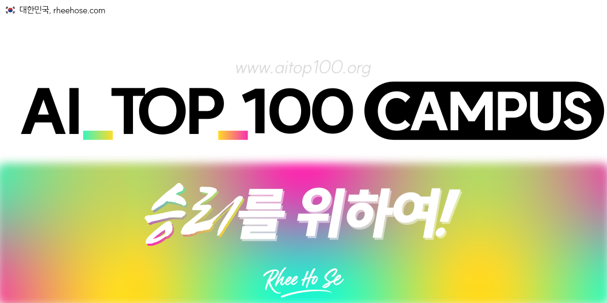

  

  

    <a href="https://www.rheehose.com"><b>프로젝트S 소개 & 사이트맵</b></a>
  

  

    <a href="https://www.rheehose.com">
       Website
    </a> • 
    <a href="https://x.com/rheehose">
      <picture>
        <source media="(prefers-color-scheme: dark)" srcset="https://raw.githubusercontent.com/hslcrb/Hslcrb/main/statics/logos/x_white.svg">
        
      </picture> X
    </a>
  

  <b>Rheehose (Rhee Creative) 2008-2026</b>

