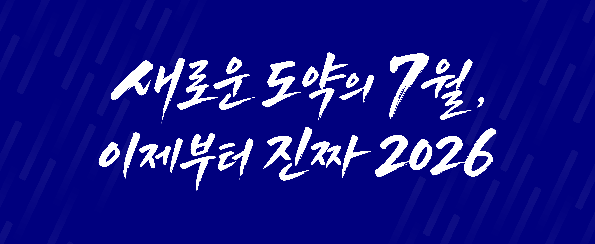
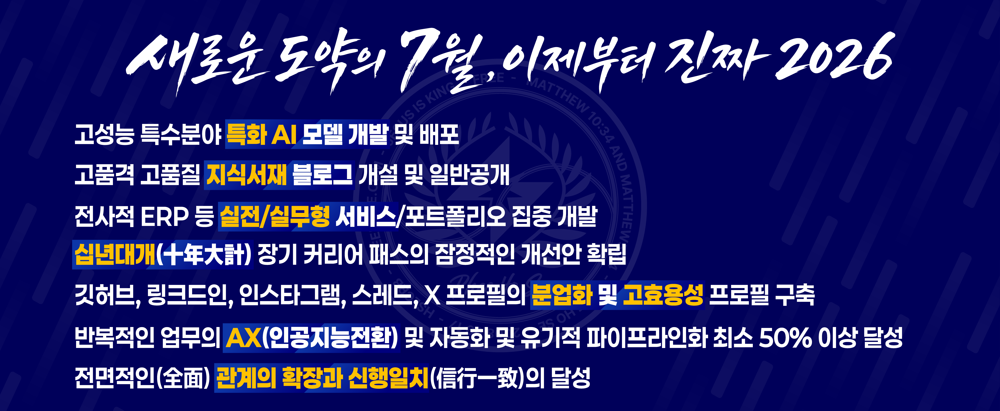

# Chat Conversation

Note: _This is purely the output of the chat conversation and does not contain any raw data, codebase snippets, etc. used to generate the output._

### User Input

README에 현존하는 것들과 같이, brush-touched-slogan.webp 와 navy-goals 를 각각 상하로 배치하라. readme 후부에 작성.

*Viewed [README.md](file:///c:/Users/user/Hslcrb/README.md) *

*Listed directory [statics](file:///c:/Users/user/Hslcrb/statics) *

*Listed directory [banner](file:///c:/Users/user/Hslcrb/statics/banner) *

*Edited relevant file*

*Viewed [README.md](file:///c:/Users/user/Hslcrb/README.md) *

### Planner Response

[README.md](file:///c:/Users/user/Hslcrb/README.md) 파일 하단에 `brush-touched-slogan.webp`와 `navy-goals.webp`를 기존 메인 히어로 이미지와 동일한 형식(`<p align="center"></p>`)으로 세로(상하) 배치하여 추가하였습니다.

### 작업 요약
* **수정 파일**: [README.md](file:///c:/Users/user/Hslcrb/README.md)
* **추가된 내용**:
  ```html
  <p align="center">
    
  </p>

  <p align="center">
    
  </p>
  ```